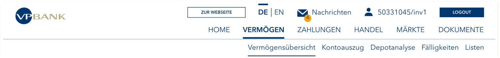
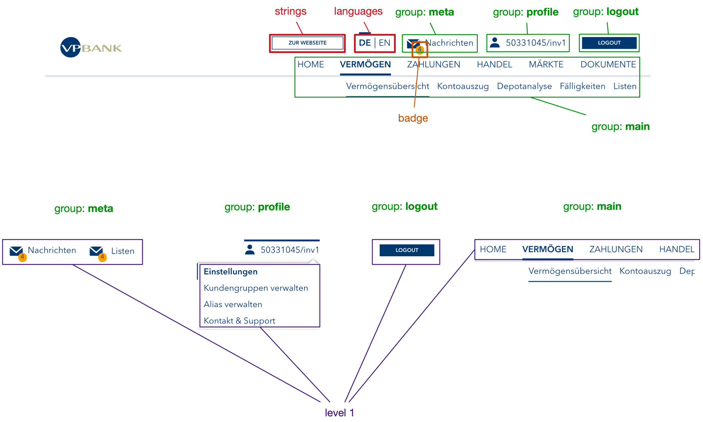
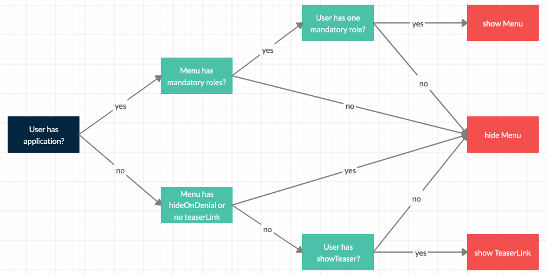
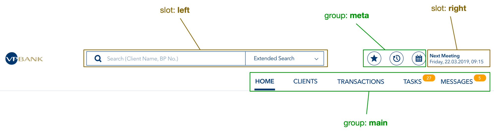

# Status Quo

Die heutige Navigation im geschützten Bereich des [VP Bank](https://www.vpbank.com/login) Portals

## Struktur

Die Navigation kennt zwei Menüstufen. Diese werden für die erste Stufe (Level 1) «Menü» und für die zweite Stufe (Level 2) «Menüitem» genannt. Somit kann ein Menü `0` bis `n` Menüitems beinhalten. Für ein Menü kann das default Menüitem definiert werden, dieses wird automatisch aktiviert, wenn das Menü selektiert wird.

| Attribut                    | Typ                       | m/o | Default              | Menü | Menüitem |
| --------------------------- | ------------------------- | --- | -------------------- | ---- | -------- |
| id                          | `String`                  | m   | -                    | x    | x        |
| defaultItem                 | `String`                  | o   | -                    | x    | -        |
| labels                      | `Array<ISO-Code, String>` | o   | -                    | x    | x        |
| link                        | `String`                  | o   | -                    | x    | x        |
| teaserLink                  | `String`                  | o   | -                    | x    | x        |
| application                 | `String`                  | o   | -                    | x    | x        |
| mandatoryRoles              | `Array<String>`           | o   | -                    | x    | x        |
| internalRouting             | `boolean`                 | o   | Wert aus WC Attribut | x    | x        |
| hideOnDenial                | `boolean`                 | o   | false                | x    | x        |
| badge                       | `String`                  | o   | -                    | x    | x        |
| enabledForMembers           | `Array<ISO-Code>`         | o   | -                    | x    | x        |
| destination                 | `String`                  | o   | -                    | x    | x        |
| internalRoutingApplications | `Array<String>`           | o   | -                    | x    | x        |
| items                       | `Array<Menüitem>`         | o   | -                    | x    | -        |
| icon                        | o                         | o   | -                    | x    | x        |

Ein Menü kann sich in einer der folgenden Gruppen befinden:

- main
- meta
- profile
- logout

Die beiden Bereiche (roten) «strings» und «languages» sind Spezialfälle. Der erste enthält einen Button für den Rücksprung (z. B. in den öffentlichen Teil) und «languages» enthält den Sprachwechsler. Sie könnten neu via Slot realisiert werden.

Die Daten für die Struktur (`data.json`) können heute entweder lokal oder remote bezogen werden. Für remote wird das `src` Attribute der Web Component verwendet. Falls dieses gesetzt ist, so hat die remote Struktur Vorrang vor der lokalen Struktur. Über einen zweiten REST Call wird der Benutzer geladen (siehe unten). In Zukunft soll es jedoch auch die Möglichkeit geben mit einem einzigen Call die Daten zu laden, welche den Benutzer und die Menüstruktur beinhaltet.

## Benutzer

Ein Benutzer-Objekt besteht aus folgenden Attribute:

- `userName`: `String` (dargestellt als Titel der profile Gruppe) (`preferred_username` Claim aus JWT)
- `userId`: `String` (`sub` Claim aus JWT)
- `applications`: `Array<Object>`
  - `name`: `String`
  - `roles`: `Array<String>`
- `showTeaser`: `boolean`
- `member`: nicht für die Sichtbarkeit verwendet (Clientportal)
- `members`: (Employeeportal)
- `environment`: `"d"` | `"s"` | `"p"`

Der Benutzer wird aktuell über die folgende URL bezogen: `/portal/api/currentuser`.

## Sichtbarkeit

Die Sichtbarkeit eines Menüs/Menüitems wird durch folgende Logik ermittelt:

## Verhalten

### Attribute der `<nav-menu>` Web Component

- `internal-routing`: `Boolean` (bei `true` kann das Item überschreiben)
- `current-application`: `String` (Name einer Applikation, nur wenn `internal-routing = true`)
- `src` : URL für remote `data.json`

### Ausgehende Events

- `portal.routeTo`
- `portal.setLanguage`
- `portal.setCurrentUser`
- `portal.setActiveItem`

### Events Listeners

- `portal.navigationSync`
- `portal.setUnreadMessageCount`
- `portal.getLanguage`

## Vorgesehene Änderungen für Refactoring

- Zwei Slots: "left" und "right"
- Badges für alle Menü/Menüitems
- Icons für alle Menü/Menüitems (mit und ohne Label)
- Darstellung bei (zu-)vielen Level 1/2 Menüs
- Support ES Modules
- Auslagerung des Sprachwechslers

Mit diesen Anpassungen könnte dann eine solche Navigation realisiert werden:

